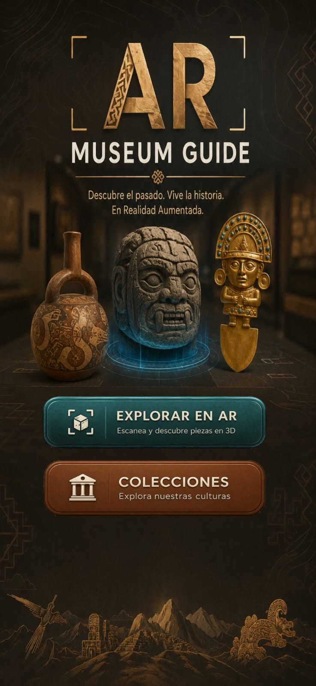
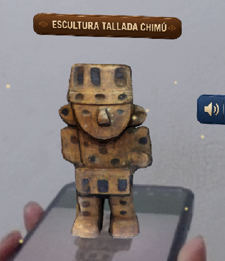
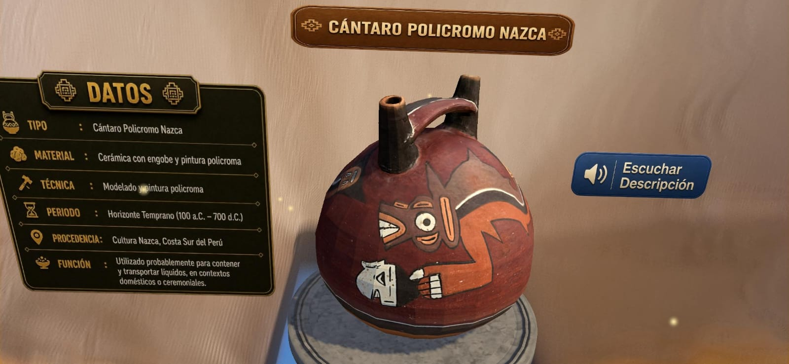
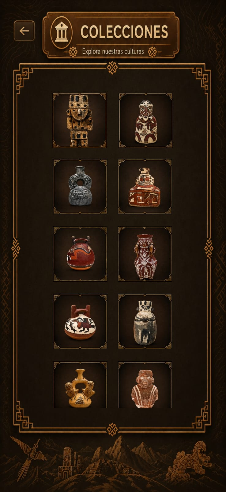
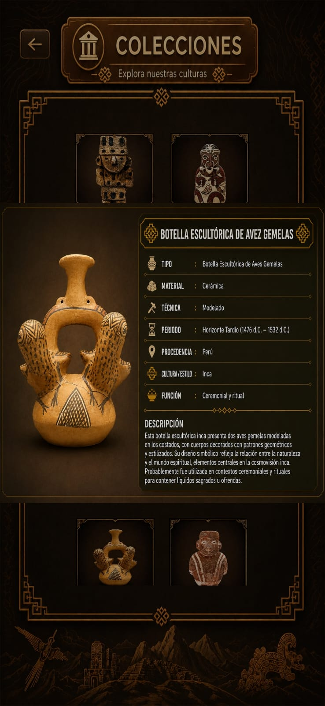
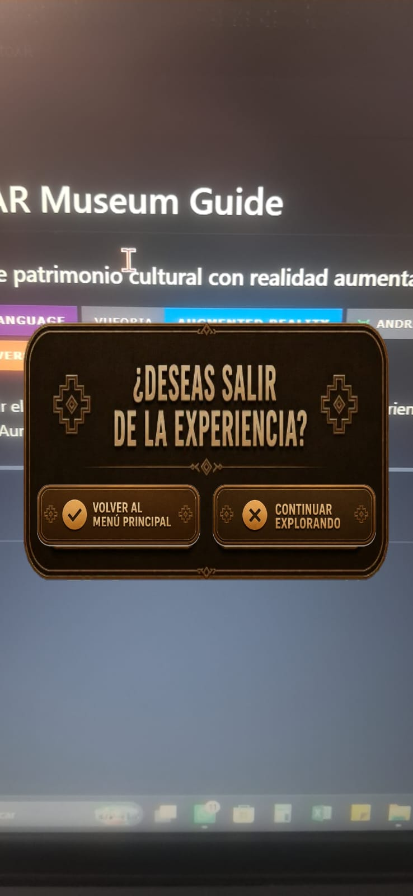
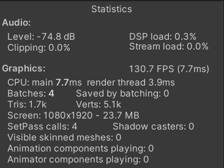

# Plan de Pruebas

# Museum Guide

## 1. Objetivo

El presente plan de pruebas tiene como finalidad verificar el correcto funcionamiento de la aplicación **Museum Guide**, desarrollada en Unity con tecnología de Realidad Aumentada mediante Vuforia Engine.

Las pruebas realizadas buscan comprobar que las funcionalidades principales de la aplicación respondan de forma correcta y estable, garantizando una experiencia adecuada para el usuario final durante la exploración de las piezas arqueológicas del museo.

---

# 2. Alcance

Las pruebas abarcan las funcionalidades implementadas durante el desarrollo del proyecto:

- Inicio de la aplicación.
- Navegación entre escenas.
- Reconocimiento de Image Targets.
- Visualización de modelos tridimensionales.
- Visualización del panel descriptivo.
- Funcionamiento de la escena Colecciones.
- Apertura de la ficha informativa de cada pieza.
- Salida de la experiencia.
- Verificación del rendimiento de la aplicación.

---

# 3. Entorno de pruebas

| Elemento | Descripción |
|----------|-------------|
| Motor de desarrollo | Unity 2022.3 LTS |
| Lenguaje | C# |
| SDK RA | Vuforia Engine |
| Plataforma | Android |
| Sistema Operativo | Windows 11 (desarrollo) |
| Dispositivo de prueba | Smartphone Android |

---

# 4. Casos de prueba

---

## Caso de Prueba 01

### Inicio correcto de la aplicación

**Objetivo**

Verificar que la aplicación inicia correctamente y muestra el menú principal sin errores.

**Procedimiento**

1. Ejecutar la aplicación.
2. Esperar la carga inicial.

**Resultado esperado**

El menú principal debe mostrarse correctamente con todos sus botones visibles y funcionales.

**Resultado obtenido**

La aplicación inició correctamente mostrando la interfaz principal sin errores de carga.

### Evidencia

    

**Estado:** Aprobado

---

## Caso de Prueba 02

### Reconocimiento del marcador (Image Target)

**Objetivo**

Comprobar que el sistema reconoce correctamente un marcador registrado en Vuforia.

**Procedimiento**

1. Enfocar el marcador con la cámara.
2. Esperar el reconocimiento.

**Resultado esperado**

El marcador debe ser detectado automáticamente y mostrar el modelo correspondiente.

**Resultado obtenido**

El Image Target fue reconocido correctamente, permitiendo visualizar la pieza arqueológica asociada.

### Evidencia

    

**Estado:** Aprobado

---

## Caso de Prueba 03

### Visualización del panel descriptivo

**Objetivo**

Verificar que el panel informativo muestra correctamente la información correspondiente a la pieza arqueológica.

**Procedimiento**

1. Detectar un objeto.
2. Visualizar el panel descriptivo.

**Resultado esperado**

Debe mostrarse el nombre, la descripción y la información histórica de la pieza.

**Resultado obtenido**

El panel presentó correctamente toda la información correspondiente a la pieza seleccionada.

### Evidencia

    

**Estado:** Aprobado

---

## Caso de Prueba 04

### Funcionamiento de la escena Colecciones

**Objetivo**

Comprobar que la escena Colecciones carga correctamente todas las miniaturas disponibles.

**Procedimiento**

1. Ingresar a la sección Colecciones.
2. Verificar las miniaturas.

**Resultado esperado**

Las piezas arqueológicas deben mostrarse correctamente organizadas dentro de la colección.

**Resultado obtenido**

La escena mostró correctamente todas las miniaturas permitiendo una navegación fluida.

### Evidencia

    

**Estado:** Aprobado

---

## Caso de Prueba 05

### Visualización de la ficha informativa

**Objetivo**

Verificar que al seleccionar una miniatura se muestre la ficha ampliada del objeto.

**Procedimiento**

1. Abrir la escena Colecciones.
2. Seleccionar una pieza.

**Resultado esperado**

Debe visualizarse correctamente la ficha con la información correspondiente.

**Resultado obtenido**

La ficha informativa se abrió correctamente mostrando la información del objeto seleccionado.

### Evidencia

    

**Estado:** Aprobado

---

## Caso de Prueba 06

### Salida de la experiencia

**Objetivo**

Verificar que el botón de salida permite regresar correctamente al menú principal.

**Procedimiento**

1. Seleccionar la opción Salir.
2. Confirmar la acción.

**Resultado esperado**

La aplicación debe regresar al menú principal sin presentar errores.

**Resultado obtenido**

La navegación se realizó correctamente retornando al menú principal.

### Evidencia

    

**Estado:** Aprobado

---

## Caso de Prueba 07

### Verificación del rendimiento

**Objetivo**

Comprobar el rendimiento general de la aplicación durante la ejecución.

**Procedimiento**

1. Ejecutar la aplicación.
2. Visualizar el panel de estadísticas de Unity.

**Resultado esperado**

La aplicación debe mantener un rendimiento estable sin pérdidas significativas de FPS.

**Resultado obtenido**

Durante las pruebas la aplicación mantuvo un comportamiento estable con un rendimiento adecuado para dispositivos móviles.

### Evidencia

    

**Estado:** Aprobado

---

# 5. Resumen de resultados

| Caso | Funcionalidad | Estado |
|------|---------------|--------|
| CP-01 | Inicio de la aplicación | Aprobado |
| CP-02 | Reconocimiento del Image Target | Aprobado |
| CP-03 | Panel descriptivo | Aprobado |
| CP-04 | Escena Colecciones | Aprobado |
| CP-05 | Ficha informativa | Aprobado |
| CP-06 | Salida de la experiencia | Aprobado |
| CP-07 | Rendimiento | Aprobado |

---

# 6. Conclusiones

Las pruebas realizadas permitieron comprobar que las funcionalidades principales de **Museum Guide** operan de acuerdo con los objetivos planteados durante el desarrollo del proyecto. El reconocimiento de los Image Targets, la visualización de los modelos tridimensionales, la navegación entre escenas y la consulta de información de las piezas arqueológicas se ejecutaron de manera satisfactoria.

Asimismo, durante las pruebas de rendimiento se observó un comportamiento estable de la aplicación, manteniendo una experiencia fluida para el usuario. En conjunto, los resultados obtenidos evidencian que el sistema se encuentra en condiciones adecuadas para su utilización como una herramienta interactiva de apoyo a la difusión del patrimonio cultural peruano.