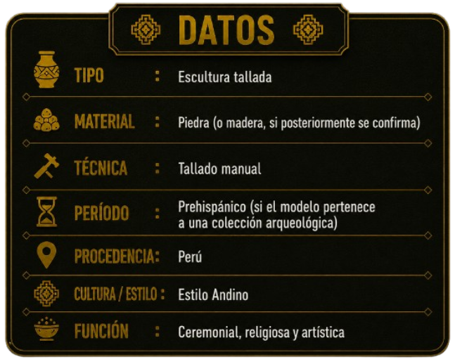
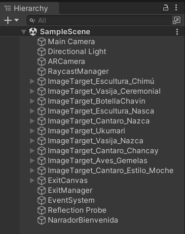
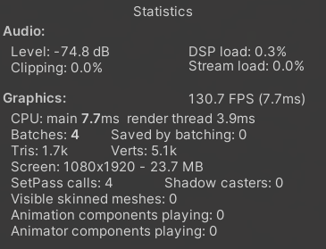

<div align="center">

#  AR Museum Guide
### “Guía Interactiva de patrimonio cultural con realidad aumentada”


Aplicación desarrollada para difundir el patrimonio arqueológico peruano mediante experiencias de Realidad Aumentada utilizando Unity y Vuforia.

</div>

---

# Índice

- Descripción
- Objetivos
- Características
- Tecnologías utilizadas
- Arquitectura del proyecto
- Estructura del repositorio
- Piezas arqueológicas
- Instalación
- Uso
- Capturas
- Integrantes
- Curso
- Universidad
- Licencia

---

# Descripción

Museum Guide es una aplicación móvil desarrollada en **Unity** que utiliza **Realidad Aumentada (RA)** mediante **Vuforia Engine** para reconocer marcadores (Image Targets) y mostrar modelos tridimensionales de piezas arqueológicas pertenecientes a distintas culturas del Perú.

Cada pieza incorpora:

- Modelo 3D
- Panel descriptivo
- Audio narrativo
- Información histórica

El proyecto busca promover el aprendizaje del patrimonio cultural peruano mediante una experiencia interactiva.

---

# Objetivos

- Difundir el patrimonio arqueológico peruano.
- Aplicar tecnologías de Realidad Aumentada.
- Visualizar modelos tridimensionales.
- Integrar información histórica y audio.
- Mejorar la experiencia educativa mediante dispositivos móviles.

---

#  Características

- Aplicación Android.
- Reconocimiento de Image Targets.
- Visualización de modelos 3D.
- Audio descriptivo.
- Panel informativo.
- Escena de Colecciones.
- Menú principal.
- Salida de la experiencia RA.
- Interfaz adaptada para dispositivos móviles.

---

# Tecnologías utilizadas

| Tecnología | Uso |
|------------|-----|
| Unity 2022.3 LTS | Motor gráfico |
| C# | Programación |
| Vuforia Engine | Realidad Aumentada |
| Android SDK | Compilación móvil |
| Git | Control de versiones |
| GitHub | Repositorio |

---

#  Arquitectura del proyecto

```
ProyectoXR
│
├── Assets
│
├── Docs
│   ├── capturas
│   └── arquitectura.md
│
├── Evidencias
│
├── Packages
│
├── ProjectSettings
│
├── QCAR
│
├── Videos
│
├── README.md
│
└── PLAN_PRUEBAS.md
```

---

#  Organización de Assets

```
Assets
│
├── Audio
├── Fonts
├── Materials
├── Models
├── Plugins
├── Prefabs
├── Scenes
├── Scripts
├── Sprites
├── StreamingAssets
└── Vuforia
```

---

#  Piezas arqueológicas implementadas

El proyecto incorpora modelos tridimensionales correspondientes a distintas culturas del Perú.

| Cultura | Pieza |
|---------|-------|
| Chancay | Cántaro Escultórico Chancay |
| Nazca | Vasija Ceremonial Nazca |
| Moche | Cántaro estilo Moche |
| Nazca | Botella Escultórica de Aves Gemelas |
| Ukumari | Vasija Ukumari Andina |
| Nazca | Cántaro Policromo Nazca |
| Nazca | Ceremonial Nazca |
| Chavín | Botella Chavín |
| Chimú | Vasija Chimú |
| Chimú | Figura Chimú |

---

# Instalación

## Clonar el proyecto

```bash
git clone https://github.com/Leo479-hub/ProyectoXR.git
```

## Abrir el proyecto

1. Abrir Unity Hub.
2. Seleccionar **Open Project**.
3. Elegir la carpeta del proyecto.
4. Esperar la importación.
5. Ejecutar la escena **MainMenu**.

---

# Uso

1. Ejecutar la aplicación.
2. Seleccionar **Explorar en RA**.
3. Enfocar un marcador.
4. Visualizar el modelo.
5. Escuchar el audio.
6. Leer la descripción.
7. Explorar la escena **Colecciones**.

---

# Capturas


<h3> Menú Principal </h3>

<p align="center">
  
</p>

<h3> Escena Colecciones </h3>

<p align="center">
  
</p>

<h3> Panel Descriptivo </h3>

<p align="center">
  
</p>


<h3> Modelo 3D (Muestra) </h3>

<p align="center">
  
</p>

<h3> Jerarquía de Image Targets </h3>

<p align="center">
  
</p>

<h3> FPS Obtenidos </h3>

<p align="center">
  
</p>

---

# Integrantes

| Integrante | Rol |
|------------|-----|
| Saldaña Lobatón Jacques | Desarrollo de la interfaz de usuario (UI), documentación y pruebas. |
| Taipe Monge Daniela | Investigación de piezas arqueológicas, recopilación de información histórica y elaboración de contenidos. |
| Huarancca Ayala David Asaf | Integración de modelos 3D, configuración de Vuforia e implementación de la experiencia de Realidad Aumentada. |
| Rau Bravo Leonardo Cesar | Desarrollo principal del proyecto en Unity, programación en C#, integración de escenas, implementación de audios, paneles descriptivos, gestión del repositorio Git/GitHub y documentación técnica. |

---

#  Curso

**Realidad Virtual y Aumentada**

---

#  Universidad

**Universidad Autónoma del Perú**

---

#  Licencia

Proyecto desarrollado con fines académicos para el curso de **Realidad Virtual y Aumentada**.

---

<div align="center">

###  Gracias por visitar nuestro proyecto 

</div>